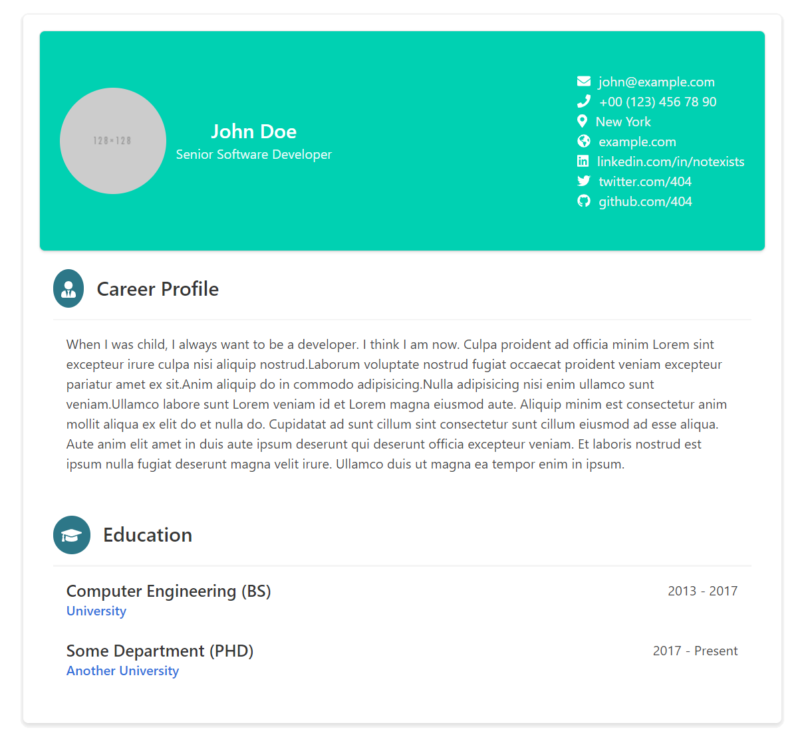

# React-CV: Your Professional Resume Builder

> Elevate your professional presence with React-CV — a versatile, ready-to-use resume component for React and Next.js. Craft a stunning CV that prints beautifully!

React-CV is not just a component; it's the next step in professional self-presentation. With React-CV, you can effortlessly build a responsive, printable, and customizable CV that stands out. Whether you're using React, Gatsby, or Next.js, React-CV is the perfect tool for creating resumes that make an impact.

Experience the power of React-CV with our [Live Demo](https://sbayd.github.io/react-cv/)!

[](https://www.npmjs.com/package/react-cv) [](https://standardjs.com)



### Why React-CV?

-   **Seamless Integration**: Plug React-CV into your existing React or Next.js applications with zero hassle.
-   **Fork & Customize**: Not a fan of starting from scratch? Fork our repo, tweak `data.js`, and you're good to go!
-   **Print-Perfect**: Your CV will look just as good on paper as it does on screen.
-   **Responsive Design**: Looks great on all devices, from desktop to mobile.
-   **Markdown Magic**: Now with markdown support in the `description` property for richer text formatting.

### Quick Start

Install with npm:

```shell
npm install react-cv
```

Install with yarn:

```shell
yarn add react-cv
```

Install with pnpm:

```shell
pnpm add react-cv
```


### Crafting Your CV

Here's a simple example to get your resume up and running in minutes:


```jsx
import React, { Component } from 'react'

import CV from 'react-cv'

class Example extends Component {
  render () {
    return (
      <CV
        personalData={{
          name: 'S. Berkay Aydin',
          title: 'Senior Software Developer',
          image: 'https://bulma.io/images/placeholders/128x128.png',
          contacts: [
            { type: 'email', value: 'john@example.com' },
            { type: 'phone', value: '+00 (123) 456 78 90' },
            { type: 'location', value: 'New York' },
            { type: 'website', value: 'example.com' },
            { type: 'linkedin', value: 'linkedin.com/in/sbaydin' },
            { type: 'twitter', value: 'twitter.com/sbayd' },
            { type: 'github', value: 'github.com/sbayd' }
        ]}}
        sections= {[{
          type: 'text',
          title: 'Career Profile',
          content: `When I was a child, I always wanted to be a developer..then this hapened **You can use markdown here**`,
          icon: 'usertie'
        }]}
        branding={true} // or false to hide it.
      />
    )
  }
}
```

## Advanced Usage & Prop List

React-CV only requires basic personal data to work. All other props are optional.
Here are the complete list of props and descriptions.

### List of Props
- Personal Data

    Name of Prop: personalData
    Type: Object
    Schema:
    ```js
    {
    name: 'String',
    title: 'String',
    image: 'String', // URL
    contacts: [ // Array of objects
        { // Single contact object
            type: 'String', // Available values ['email', 'phone', 'location', 'website', 'github', 'linkedin', 'twitter']
            value: 'String'
        }
    ]
    }
    ```

- Sections (Experiences, Projects, Career Profile, Skills, ETC)

    Name of Prop: sections
    Type: Array Of  Objects
    Schema of single object:
    ```js
    {
    type: 'String', // Available values ['text', 'common-list', 'projects-list', 'tag-list']
    title: 'String',
    icon: 'String or SVG Icon', // Available values ['graduation', 'book', 'comments', 'tasks', 'archive', 'rocket', 'language', 'cubes', 'usertie'] or FontAwesome SVG Icon
    description: 'String',
    groups: [ // Array of Object, if type is only projects-list
        { // Schema of single group object
          sectionHeader: 'Company Name',
          description: 'Optional',
          items: [
            { title: 'Project', projectUrl: 'optional', description: 'Optional' },
          ]
        }
    },
    items: [ // Array of Objects(type:common-list) or Array of Strings(type:tag-list)
        {
              title: 'Some Conferences / 2019',
              authority: 'SomeConf',
              authorityMeta: 'Speaker',
              authorityWebSite: 'https://www.someconf.somesome',
              rightSide: 'test'
        }
    ]
    ```

Too Lazy to read documentation? See working versions in example:

[Example App Code](https://github.com/sbayd/react-cv/blob/master/example/src/App.js)

[Example Data Format With Full Types (Code)](https://github.com/sbayd/react-cv/blob/master/example/src/data.js)


## Change Log

 - 1.5.1 : Build system updates

 - 1.3.0 : Markdown support on description, React 18 and build tool updates.

 - 1.2.0 : Print CSS improvements

## License

MIT © [sbayd](https://github.com/sbayd)


contributors

[sbayd](https://github.com/sbayd)

[robinknox](https://github.com/robinknox)
